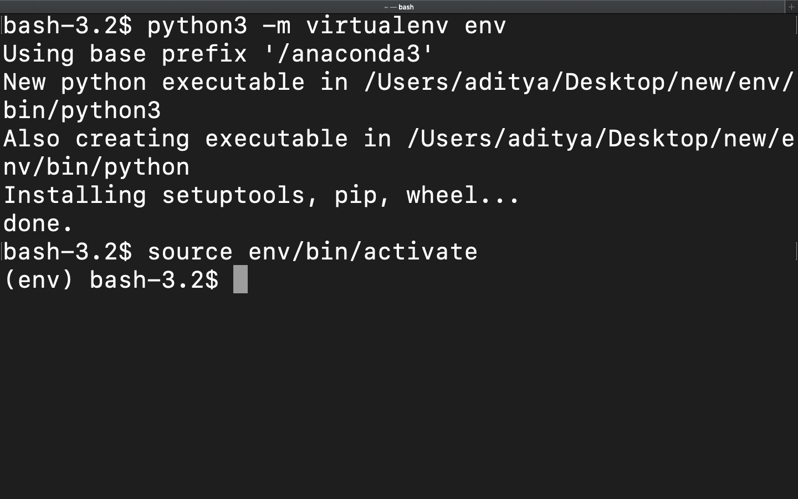
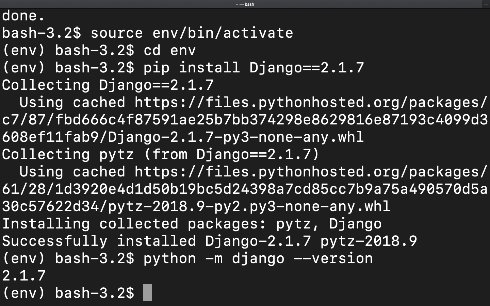
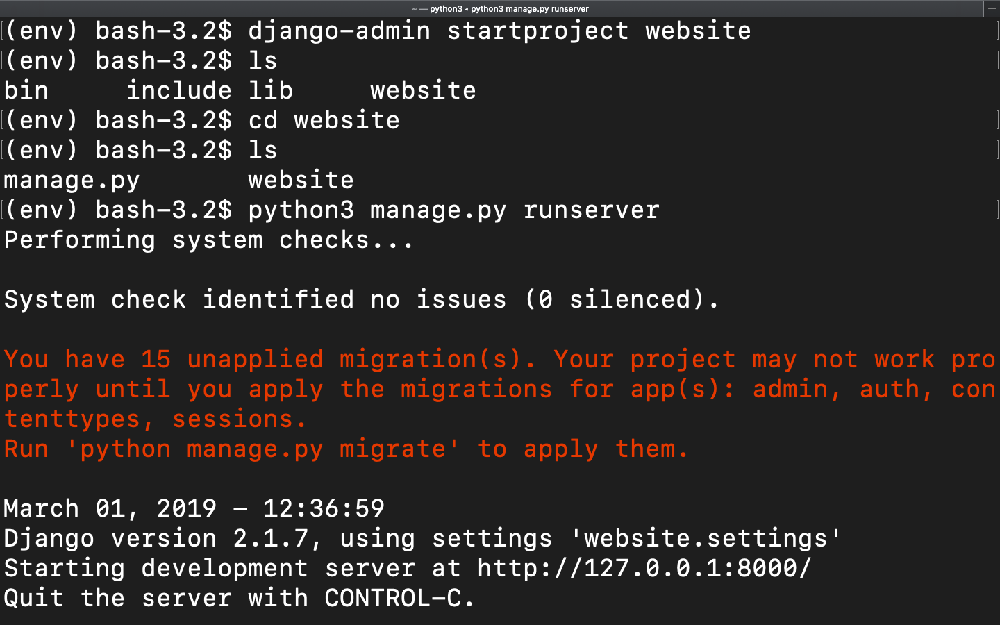
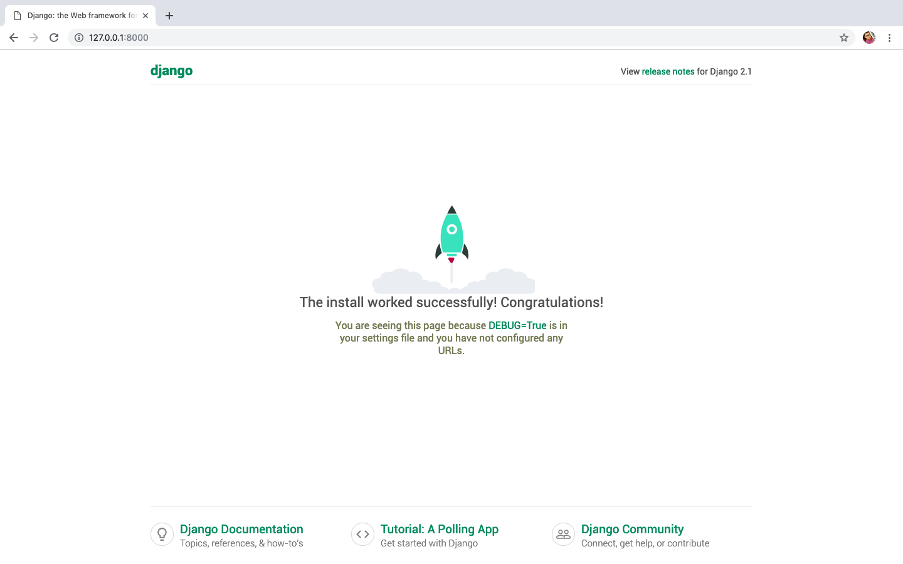

# Django : Creating Web App

### Creating Virtual Environment
> ```
> // On macOS and Linux:
> $ python3 -m virtualenv env
>
> // On Windows:
> py -m virtualenv env
> 
> ```

### Acrivating Virtual Environment
> ```
> // On macOS and Linux:
> $ source env/bin/activate
>
> // On Windows:
> $ .\env\Scripts\activate
>
> Deactivating Virtual Environment
> $ deactivate
> ```


### Installing Django
> ```
> $ cd env      // Move inside the virtual environment directory here we have env as virtual environment.
> $ pip install Django==2.1.7
> ```

### Checking Installed version of the Django
> ```
> $ python -m django --version
> ```

### Creating Project
> ```
> $ django-admin startproject website    //This will create a website directory in your current directory
> ```


### Running on the local host
> ```
> $ python manage.py runserver      
> ```


After you have done everything right type the url in the browser and it will look as 



### Books , References and Sources
- Virtual Environment and pip [Read More...](https://packaging.python.org/guides/installing-using-pip-and-virtualenv/)
- [Django Official Site](https://docs.djangoproject.com/en/2.1/intro/tutorial01/#creating-a-project)
